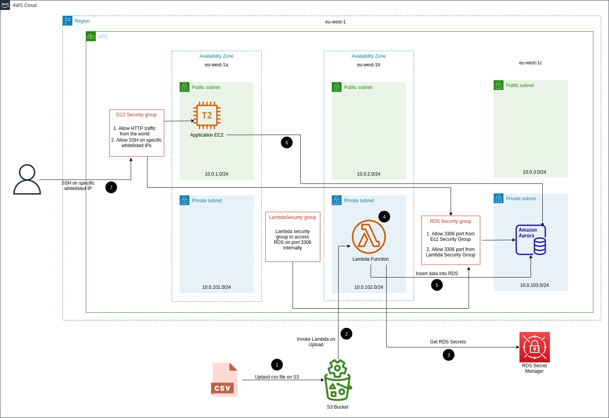

# Architecture

> **_NOTE:_** If the image content is not clearly visble, then you can have a clear view of the image by clicking on it.

## Architecture Flow
The high level flow of this infrastruture is to populate data in RDS by processing the csv file using lambda 
whenever csv gets uploaded on S3 bucket, then the data would be used by the application running on ec2 instance.
### Steps as pointed in Digrams
1. When a csv file is uploaded on the s3 bucket.
2. It would trigger the lambda function, the lambda function would only be invoked if the file uploads with `.csv` extension.
   Permission are added on lambda to be triggered by S3 on upload events.
3. Lambda function would read RDS secrets such as `endpoint, username, password, db name` from **AWS Secret Manager**
   > Permissions to read Secrets from Secret Manager are added in Lambda Execution Role.
4. Now Lambda would create connection with RDS, get csv file from the event, open the file then process it.
5. After processing it would insert data into RDS db.
   > As RDS Auroa is `**private**` so lambda should be in `**vpc private subnets**` to access RDS, also lambda's security group should be whitelisted in RDS's Security group against port `3306`.
6. As per assumption there is an theoretical application running in ec2 instance, it has to access data from RDS.
   > EC2's security group should also be whitelisted in RDS's security group against port `3306`.
7. To access ec2 over `ssh` user's ip or vpn ip should be whitelisted in ec2's security group. As default ssh is not allowed in its ingress.


# Getting Started

## Versions
* AWS Provider version is **3.70.0**
* Terraform **0.14.7**


### Folder Structure

    sre-challenge-syed-ali
    ├── environments                # .tfvars file for all environments
    |   |── dev.tfvars                # variables initialization file for dev environment workspace
    |   └── stage.tfvars              # variables initialization file for stage environment workspace
    ├── modules                     # Terraform generic modules provided by terraform registry   
    │   ├── ec2                       
    |   |   ├── outputs.tf          
    |   |   ├── resource.tf         
    |   |   └── variables.tf
    │   ├── iam-role                  
    |   |   ├── outputs.tf          
    |   |   ├── resource.tf         
    |   |   └── variables.tf
    │   ├── lambda                  
    |   |   ├── outputs.tf          
    |   |   ├── resource.tf         
    |   |   └── variables.tf
    │   ├── rds           
    |   |   ├── outputs.tf          
    |   |   ├── resource.tf         
    |   |   └── variables.tf
    │   ├── s3               
    |   |   ├── outputs.tf          
    |   |   ├── resource.tf         
    |   |   └── variables.tf   
    │   ├── security-group        
    |   |   ├── outputs.tf          
    |   |   ├── resource.tf         
    |   |   └── variables.tf     
    │   ├── vpc                     
    |   |   ├── outputs.tf          
    |   |   ├── resource.tf         
    |   |   └── variables.tf
    ├── .gitingnore
    ├── architecture.jpg
    ├── backend.tf                  # Terraform remote state backend configuration on s3
    ├── ec2.tf                      # Theoretical application module
    ├── iam.tf                      # app ec2 and lambda execution roles modules
    ├── lambda.tf                   # Lambda module to insert data into 
    ├── outputs.tf                  # All resoruces outputs to export during provisioning 
    ├── provider.tf                 # Terraform aws provider configuration
    ├── rds.tf                      # RDS Aurora mysql module
    ├── README.md                   # README.md file of whole infrastructure
    ├── s3.tf                       # S3 module to invoke lambda on csv file upload
    ├── security_group.tf           # app ec2, rds, lambda security groups modules
    ├── tags.tf                     # Common tags for all resources
    ├── variables.tf                # All terraform modules variables declaration with default values
    └── vpc.tf                      # VPC module with mutli az public and private subnets

## Terraform setup to provision Infrastructure

We would be provisioning infra for `stage` environment

### Configure region where you want to provsion aws resources
By default `ireland (eu-west-1)` region is configured.
If you want to change the region then change the variable value in `sre-challenge-syed-ali/environments/stage.tfvars`
```bash
# default region
region   = "eu-west-1" 
```

### Configure S3 backend backet to store remote state
In `backend.tf` file
```bash
terraform {
  backend "s3" {
    bucket = "terraform-remote-state-bkt"
    key    = "terraform/terraform.tfstate"
    region = "eu-west-1"
  }
}
```
`terraform-remote-state-bkt` s3 bucket is already made in `eu-west-1` to store remote state of terraform.
If you want change it, then create new bucket and change the variables values in the above snuppet. 
Otherwise leave the configuration as it is.

### Export AWS Credentials to run terraform code
The AWS provider offers a flexible means of providing credentials for authentication. The following methods are supported, in this order, and explained below:

* Static credentials
* Environment variables
* Shared credentials/configuration file
* CodeBuild, ECS, and EKS Roles
* EC2 Instance Metadata Service

I used exporting Environment variables
so replace ***** with original credentials and export in the terminal of the root dir `sre-challenge-syed-ali`
> export AWS_ACCESS_KEY_ID="*****"                                                                                       
> export AWS_SECRET_ACCESS_KEY="******"

### Initialize Terraform working dir
Run the following command in the workinf dir `sre-challenge-syed-ali`
> terraform init

It would install
* providers
* modules
* terraform.tfstate file (s3 backend information)

### Create Workspace for multi environment infrastructure
* Workspace is used to create same resources for multiple environments
* Code reuseability for all enviroments so no code repetition

As we are deploying `stage` infra so first of all run this command to check either `stage` workspace exist or not
>  terraform workspace list              # to see stage workspace
   terraform workspace select stage      # to select stage workspace

if workspace does not exist then create it
> terraform workspace new stage            # create new workspace
        


#TODO how to zip code